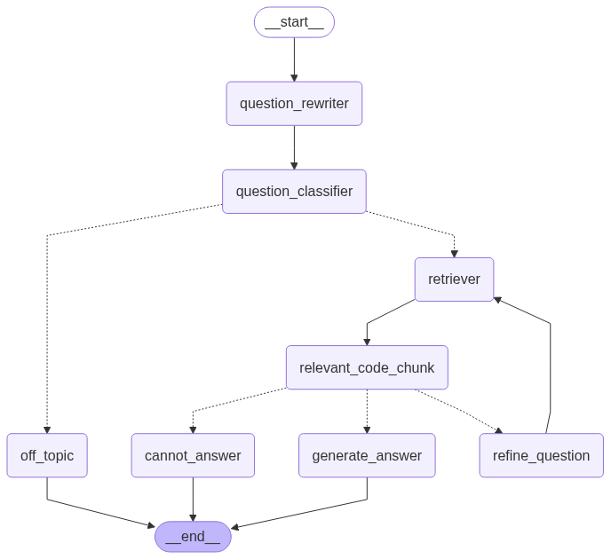

# GitSpeak

An AI-powered GitHub repository analyzer using LangGraph for structured workflows and real-time streaming responses.

## Features

- **Repository Analysis**: Deep analysis of GitHub repositories with code understanding
- **Streaming Responses**: Real-time AI responses with character-by-character streaming
- **Persistent Memory**: SQLite-based state management and conversation history
- **Vector Search**: FAISS-powered semantic code search
- **Multi-Repository Support**: Handle multiple repositories with caching
- **LangGraph Workflow**: Structured analysis pipeline with question refinement

## Architecture


## Setup

1. Clone the repository
2. Install dependencies:
```bash
pip install langchain langchain-openai faiss-cpu chainlit langgraph pydantic python-dotenv GitPython
```

3. Set environment variables:
```bash
OPENAI_API_KEY=your_api_key_here
```

## Usage

1. Start the server:
```bash
chainlit run app.py
```

2. Open web interface at `http://localhost:8000`

3. Enter a GitHub repository URL

4. Start asking questions about the codebase

## Command Line Options

- `--cleanup N`: Clean up sessions older than N days
- `--list-repos`: List all repositories
- `--stats HASH`: Get stats for repository hash
- `--db-stats`: Show SQLite database statistics
- `--backup-db [PATH]`: Backup SQLite database
- `--list-threads`: List all workflow threads

## Architecture Components

### 1. User Interface Layer
- Chainlit-based web interface
- Real-time streaming responses

### 2. Core Processing Layer
- LangGraph workflow orchestration
- Question analysis and refinement
- Semantic code retrieval
- Relevance filtering
- Answer generation

### 3. Data Storage Layer
- FAISS vector store for code embeddings
- SQLite for workflow state persistence

### 4. External Services
- GitHub Library for repository access
- OpenAI API for embeddings and chat
- Vector similarity search
